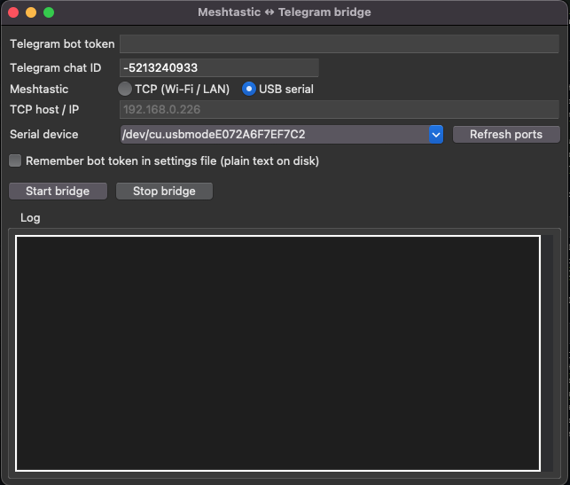

# Meshtastic ↔ Telegram Group Bridge

This project retransmits Meshtastic text messages to a dedicated Telegram group and sends supported Telegram commands back to the mesh. It includes a desktop GUI and a headless script. Use `/todos` for broadcasts and `/!xxxxxxxx` for a direct message to an 8-hex node ID.

## Run the GUI

```bash
python -m venv .venv
source .venv/bin/activate   # Windows: .venv\Scripts\activate
pip install -r requirements.txt
python mesh_bridge_gui.py
```

Fill in **Telegram bot token**, **chat ID**, and either **TCP host** or **USB serial** device. Use **Start bridge** / **Stop bridge**.

### Saved settings

The GUI stores settings under the OS config directory (`platformdirs`), file `settings.json`. The bot token is saved **only** if you enable **Remember bot token**; otherwise it is stored as empty on disk (plain JSON is not encrypted—do not share that file).

### Linux and tkinter

If `import tkinter` fails, install the Tk bindings, for example:

```bash
sudo apt install python3-tk
```

## Run headless (CLI)

Use a JSON file (see `mesh_telegram_config.example.json`) or environment variables.

```bash
cp mesh_telegram_config.example.json mesh_telegram_config.json
# edit mesh_telegram_config.json
python mesh_to_telegram.py --config mesh_telegram_config.json
```

Or with environment variables:

| Variable | Meaning |
|----------|---------|
| `TELEGRAM_BOT_TOKEN` or `MESH_TELEGRAM_TOKEN` | Bot token |
| `MESH_TELEGRAM_CHAT_ID` or `TELEGRAM_CHAT_ID` | Integer chat ID |
| `MESH_TELEGRAM_TRANSPORT` | `tcp` or `serial` |
| `MESH_TELEGRAM_HOST` | TCP hostname/IP (if `tcp`) |
| `MESH_TELEGRAM_SERIAL_DEV` | Serial device path (if `serial`; empty = auto-detect one port) |

## Build a standalone executable (PyInstaller)

Build **on each target OS** (or download CI artifacts). One machine cannot produce native binaries for all three platforms in one command.

```bash
pip install -r requirements.txt
pyinstaller mesh_bridge_gui.spec
```

Output: `dist/MeshTelegramBridge` (macOS/Linux) or `dist/MeshTelegramBridge.exe` (Windows).

If PyInstaller reports that **tkinter** is missing, fix your Python installation (e.g. official python.org installers include Tk; Linux needs `python3-tk`).

## GitHub Actions

The workflow `.github/workflows/build.yml` builds on Ubuntu, Windows, and macOS and uploads the native packages as artifacts:

- Ubuntu: `MeshTelegramBridge-Linux.deb`
- Windows: `MeshTelegramBridge-Windows.msi`
- macOS: `MeshTelegramBridge-macOS.dmg` containing `MeshTelegramBridge.app`

Use Python 3.12 in CI for predictable Tk and wheel support.

To publish those builds as GitHub Release assets, push a version tag beginning with `v`:

```bash
git tag v1.0.0
git push origin v1.0.0
```

The release job is skipped for branch pushes, pull requests, and manual workflow runs. Those runs only produce Actions artifacts. The tag push runs the release asset steps and creates the GitHub Release automatically.

## Telegram usage

- `/todos your message` — broadcast on the mesh (`^all`).
- `/!9ee852b8 your message` — DM node `!9ee852b8` (8 hex digits; `/9ee852b8` without `!` is also accepted).

Plain text without these commands is not sent to the mesh (help text is sent in Telegram instead).

## Telegram setup

1. Open [@BotFather](https://t.me/BotFather) in Telegram, run `/newbot`, and copy the bot token it provides. Keep the token private.
2. Create one dedicated Telegram group for this bridge, for example **Meshtastic Bridge**, and add the bot to it. Use this group as the single destination for retransmitting mesh messages; do not use a personal chat or a general-purpose group.
3. Obtain the group's numeric chat ID and set it as `telegram_chat_id` in `mesh_telegram_config.json` or as `MESH_TELEGRAM_CHAT_ID`. Group IDs normally start with `-100`; the value in `mesh_telegram_config.example.json` is only a placeholder.
4. Start the bridge. Messages received from Meshtastic are forwarded to the configured group, while `/todos ...` and `/!xxxxxxxx ...` commands posted in that group are sent to the mesh.


